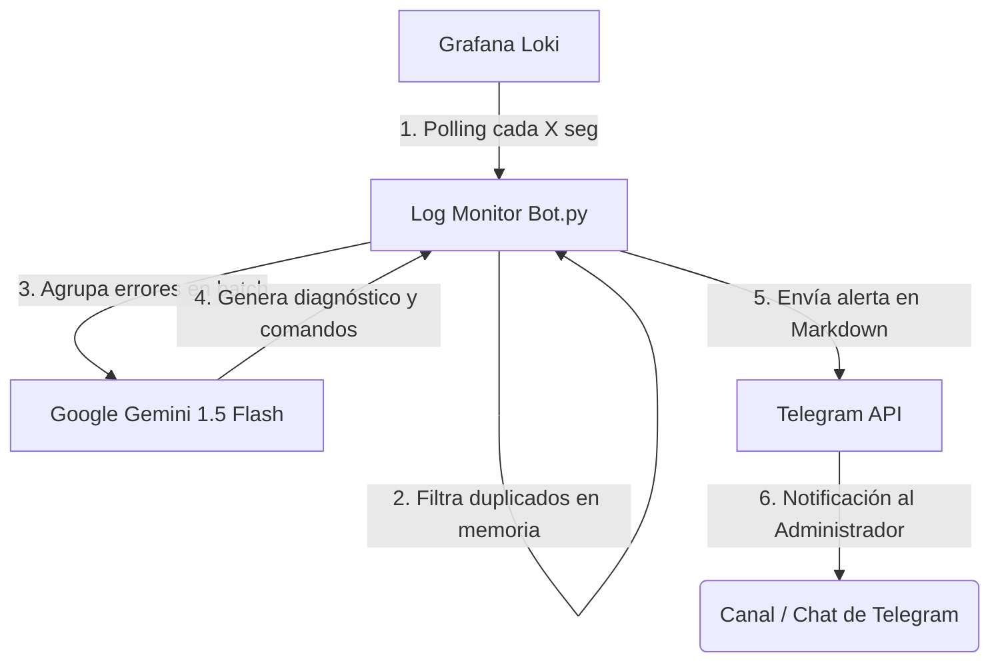

# AI DevOps Log Monitor & Analyzer Bot 🤖🪵🧠

[](https://www.python.org/)
[](https://hub.docker.com/_/python)
[](https://ai.google.dev/)
[](https://grafana.com/oss/loki/)
[](https://core.telegram.org/bots)

Una herramienta de nivel **Senior DevOps** diseñada para monitorizar de forma inteligente los logs gestionados en **Grafana Loki**, analizar anomalías y errores críticos mediante la inteligencia artificial de **Google Gemini 1.5 Flash**, y enviar diagnósticos precisos junto con soluciones inmediatas y comandos de consola formateados en Markdown directo a tu canal o chat de **Telegram**.

---

## 🏗️ Flujo de Trabajo y Arquitectura



1. **Sondeo Inteligente**: El bot realiza peticiones periódicas a la API `/loki/api/v1/query_range` buscando términos clave de error (`error`, `fatal`, `panic`).
2. **Deduplicación en Memoria**: Mantiene registro del timestamp en nanosegundos del último log procesado. Compensa el retraso de ingesta de Loki consultando una ventana de seguridad en el pasado, pero discriminando los logs repetidos a nivel de nanosegundos en memoria.
3. **Agrupamiento en Lotes (Batching)**: Los errores de una misma ventana de tiempo se analizan de manera conjunta. Esto permite a Gemini detectar fallos en cascada (ej: caída de base de datos afectando a múltiples microservicios dependientes) reduciendo llamadas y spam.
4. **Análisis Sysadmin Experto**: El bot instruye a Gemini para actuar como un Ingeniero de Sistemas/DevOps Senior, entregando respuestas breves divididas en: **Causa probable**, **Solución paso a paso** y **Comandos recomendados** en bash.
5. **Notificación Resiliente**: Se envía un reporte detallado a Telegram. El bucle infinito cuenta con captura exhaustiva de excepciones (`try-except`) para garantizar la continuidad del contenedor ante caídas de red o límites de cuota (rate limits).

---

## ✨ Características Principales

*   **Sin frameworks pesados**: Construido usando únicamente `requests`, `google-generativeai` y `python-dotenv`.
*   **Compensación de Retraso de Ingesta (Ingestion Lag)**: Diseñado para entornos reales de producción donde Loki indexa logs con algunos segundos de retraso.
*   **Filtro Antispam de Arranque**: En el inicio del bot, se establece una línea base con los logs de los últimos 5 minutos sin lanzar alertas de Telegram por eventos históricos.
*   **Seguridad Out-of-the-Box**: Dockerfile de producción basado en `python:3.11-slim` multi-etapa que ejecuta el proceso bajo un usuario no root (`appuser`).
*   **Soporte Opcional para Loki Auth**: Permite conectarse a instancias públicas básicas de Loki o aquellas que utilicen autenticación básica (Basic Auth).

---

## 📂 Archivos en el Repositorio

El proyecto consta de la siguiente estructura limpia de archivos:

1.  **[`bot.py`](file:///d:/Aplicaciones/ai-devops-bot/bot.py)**: El script principal modular con control robusto de errores, reintentos y deduplicación.
2.  **[`requirements.txt`](file:///d:/Aplicaciones/ai-devops-bot/requirements.txt)**: Lista minimalista de requerimientos para Python.
3.  **[`Dockerfile`](file:///d:/Aplicaciones/ai-devops-bot/Dockerfile)**: Dockerfile seguro y optimizado con ejecución no root.
4.  **[`docker-compose.yml`](file:///d:/Aplicaciones/ai-devops-bot/docker-compose.yml)**: Configuración lista para orquestar y desplegar con Dockge o docker-compose.
5.  **[`.env.example`](file:///d:/Aplicaciones/ai-devops-bot/.env.example)**: Plantilla con los campos de configuración vacíos.
6.  **[`README.md`](file:///d:/Aplicaciones/ai-devops-bot/README.md)**: Esta documentación completa del proyecto.


---

## ⚙️ Configuración (Variables de Entorno)

Crea un archivo `.env` en la raíz del proyecto basándote en el archivo `.env.example`:

```env
# Configuración de Grafana Loki
LOKI_URL=http://localhost:3100
# Opcional: Credenciales para Basic Auth en Loki (dejar en blanco si no se requiere)
LOKI_USER=
LOKI_PASSWORD=
# Opcional: Query personalizada de Loki (por defecto busca error, fatal o panic)
# LOKI_QUERY={job=~".+"} |~ "(?i)(error|fatal|panic)"


# Configuración de Google Gemini API
GEMINI_API_KEY=tu_api_key_de_gemini_aqui

# Configuración de Telegram Bot
TELEGRAM_BOT_TOKEN=tu_telegram_bot_token_aqui
TELEGRAM_CHAT_ID=tu_telegram_chat_id_o_canal_aqui

# Configuración del Monitor
POLL_INTERVAL_SECONDS=60
```

---

## 🚀 Guía de Despliegue e Instalación

### Opción A: Ejecución Local en Desarrollo

1.  **Clonar el repositorio**:
    ```bash
    git clone https://github.com/snchz/ai-devops-bot.git
    cd ai-devops-bot
    ```

2.  **Crear y activar un entorno virtual**:
    ```bash
    python -m venv venv
    # En Windows:
    .\venv\Scripts\activate
    # En Linux/macOS:
    source venv/bin/activate
    ```

3.  **Instalar dependencias**:
    ```bash
    pip install -r requirements.txt
    ```

4.  **Ejecutar el bot**:
    ```bash
    python bot.py
    ```

---

### Opción B: Despliegue en Docker

1.  **Construir la imagen de producción**:
    ```bash
    docker build -t ai-devops-bot:latest .
    ```

2.  **Lanzar el contenedor**:
    ```bash
    docker run -d \
      --name ai-devops-bot \
      --env-file .env \
      --restart unless-stopped \
      ai-devops-bot:latest
    ```

3.  **Inspeccionar Logs en tiempo real**:
    ```bash
    docker logs -f ai-devops-bot
    ```

---

### Opción C: Despliegue en Dockge (Recomendado para Home Labs / VPS)

**Dockge** es una herramienta excelente para gestionar tus stacks. Puedes desplegar este bot en Dockge a través de dos métodos:

#### Método 1: Clonando el repositorio localmente (Recomendado para repositorios Privados)

Para que Dockge detecte automáticamente el bot, este **debe estar clonado dentro del directorio de stacks** que Dockge tiene asignado (por defecto suele ser `/opt/stacks`):

1.  **Clonar en el directorio de stacks de tu servidor**:
    ```bash
    # Accede al directorio de stacks de Dockge
    cd /opt/stacks

    # Clona tu repositorio privado (puedes usar SSH o un PAT)
    git clone git@github.com:snchz/ai-devops-bot.git ai-devops-bot
    cd ai-devops-bot
    ```

2.  **Crear el archivo `docker-compose.yml`** dentro de esa carpeta:
    ```yaml
    version: "3.8"

    services:
      ai-devops-bot:
        build:
          context: .
          dockerfile: Dockerfile
        container_name: ai-devops-bot
        restart: unless-stopped
        env_file:
          - .env
    ```

3.  **Iniciar en Dockge**:
    *   Abre la web de **Dockge** y verás el stack `ai-devops-bot` inactivo en la barra lateral.
    *   Haz clic en él, pulsa **Edit**, añade tus credenciales en el apartado **`.env`** y haz clic en **Save** y luego en **Active**.

---

#### Método 2: Despliegue Directo desde la Web (Recomendado para repositorios Públicos)

Si tu repositorio es público, no necesitas clonar nada por SSH en tu servidor. Puedes indicarle a Dockge que construya la imagen directamente leyendo tu repositorio de GitHub desde internet:

1.  Abre la web de **Dockge** y haz clic en **Compose** (Componer).
2.  Dale el nombre `ai-devops-bot` en **Stack Name**.
3.  En el editor web de `docker-compose.yml`, pega lo siguiente:
    ```yaml
    version: "3.8"

    services:
      ai-devops-bot:
        build:
          context: https://github.com/snchz/ai-devops-bot.git#main
          dockerfile: Dockerfile
        container_name: ai-devops-bot
        restart: unless-stopped
        env_file:
          - .env
    ```

4.  Crea tu archivo **`.env`** en la pestaña correspondiente a la derecha con tus credenciales.
5.  Haz clic en **Save** y **Active**. ¡Dockge descargará tu código en memoria, construirá la imagen y levantará el bot!


---

## 📄 Licencia

Este proyecto está bajo la licencia MIT. Siéntete libre de usarlo, modificarlo y adaptarlo a tu infraestructura de producción.

Desarrollado y mantenido con 💻 por **[snchz](https://github.com/snchz)**.
