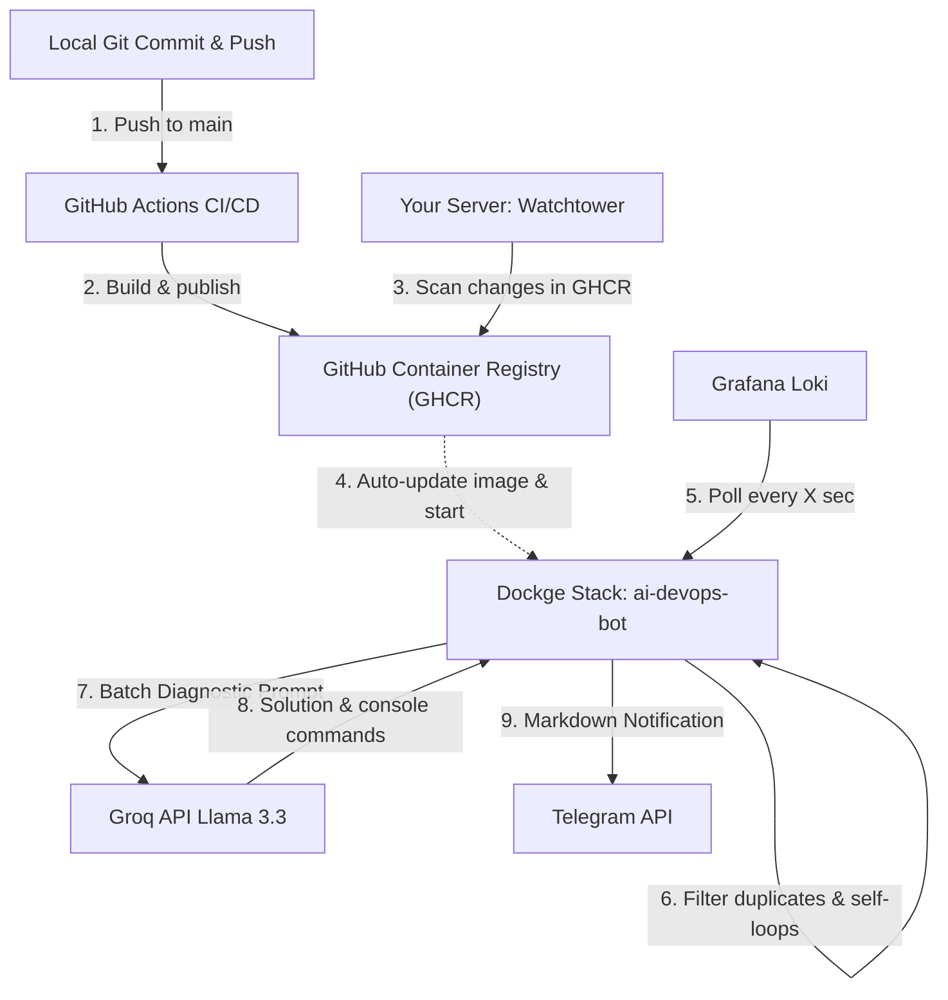
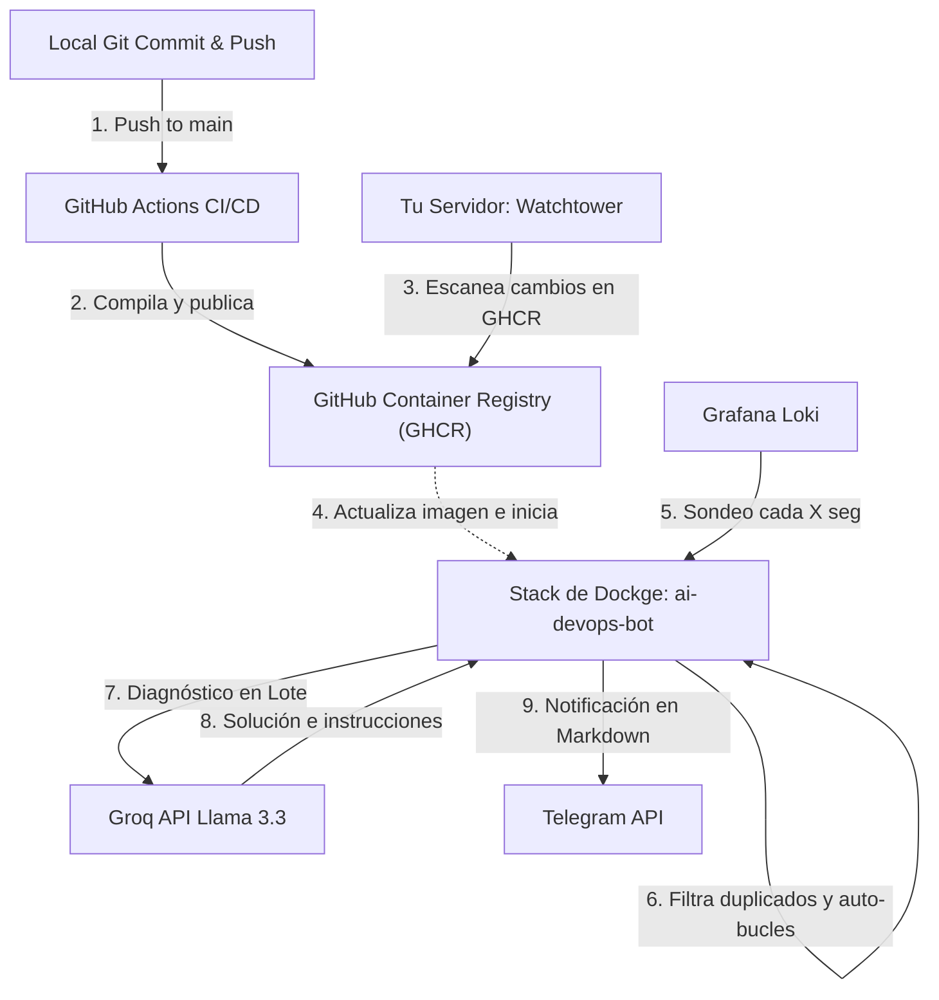

# AI DevOps Log Monitor & Analyzer Bot 🤖🪵🧠

Choose your language / Selecciona tu idioma:
*   [English Documentation 🇬🇧](#english-documentation)
*   [Documentación en Español 🇪🇸](#documentación-en-español)

---

# English Documentation

[](https://www.python.org/)
[](https://hub.docker.com/_/python)
[](https://groq.com/)
[](https://grafana.com/oss/loki/)
[](https://core.telegram.org/bots)

A **Senior DevOps** production-grade tool designed to intelligently monitor logs managed in **Grafana Loki**, analyze critical errors and anomalies using the ultra-fast **Meta Llama 3.3 (70B) AI via Groq**, and deliver highly precise diagnostics, root-cause analyses, and console-ready resolution commands formatted in Markdown directly to your **Telegram** channel or chat.

---

## 🏗️ Workflow & CI/CD Architecture




1.  **Continuous Integration (CI)**: When you push to the `main` branch, a GitHub Action automatically builds the `Dockerfile` and publishes the image securely (credentials-free) to GitHub Container Registry (GHCR).
2.  **Continuous Deployment (CD)**: Your server's **Watchtower** container scans GHCR, automatically downloads the new image in the background, and restarts the bot with zero manual downtime.
3.  **Anti-Loop LogQL Filtering**: The bot queries `/loki/api/v1/query_range` periodically. It applies an advanced LogQL filter to **ignore its own container logs and Loki's internal metric queries**, preventing infinite self-matching alert loops.
4.  **In-Memory Deduplication & Cleaning**: It tracks the nanosecond-level timestamp of the last processed log. To prevent data loss from Loki ingestion pipeline delays, it polls a overlapping 2-minute safety window and dedupes duplicates in memory.
5.  **ANSI Code Stripping**: Automatically strips ANSI console color escape sequences (`\x1b\[[0-9;]*[a-zA-Z]`), producing clean Telegram Markdown and allowing perfect deduplication of identical docker log streams.
6.  **AI Local RAG (Knowledge Base)**: Parses a local `knowledge_base.json` rulebook. If an error matches a pattern (e.g. `pvpc_hourly_pricing`), it **injects your custom diagnostic notes and exact bash fix commands** directly into Llama 3.3's prompt, overriding standard AI assumptions with your specific knowledge.

---

## ✨ Main Features

*   **Asynchronous Web Control Center (Web UI)**: A premium, dark-themed, glassmorphic dashboard served natively on `HEALTHCHECK_PORT` (default `8000`) with zero external Python dependencies.
*   **Full-Detail Incident Explorer**: View untruncated raw error log streams from Grafana Loki along with the AI's diagnostic proposal (complete with one-click code copy buttons) in a gorgeous side-by-side split screen view, bypassing all size limitations of Telegram.
*   **Interactive RAG Knowledge Base Editor**: A fully interactive Web UI to Add, Edit, or Delete custom troubleshooting patterns and resolution commands in `knowledge_base.json` with instant real-time reloading.
*   **SQLite Incident History Persistence**: Uses a local SQLite database (`history.db`) to record log telemetry history across restarts.
*   **Fully Asynchronous Engine**: Built completely on `asyncio` and `httpx` for non-blocking concurrent log processing, health monitoring, and Telegram messaging.
*   **Secure Self-Healing Subprocess Execution**: Click `[ Ejecutar Solución ⚡ ]` directly on Telegram alerts to trigger remote shell resolution commands in a 30s async subprocess!
*   **Operator Authentication Access Control**: Enforces whitelisting via `TELEGRAM_ALLOWED_USER_IDS` to securely block unauthorized execution from arbitrary Telegram users.
*   **Polymorphic AI Providers**: Toggle instantly between Groq (Meta Llama 3.3), Google Gemini (natively via REST), and Ollama (local AI models running on your hardware) via `AI_PROVIDER`.
*   **Smart Cooldown Alert Fatigue Prevention**: Automatically suppresses duplicate error logs within the configured `COOLDOWN_MINUTES` window to keep your channels quiet.
*   **Prometheus & Healthcheck Server**: Exposes `/healthz` and standard `/metrics` ports asynchronously using zero third-party dependencies.
*   **JSON Structured Logging**: Output standardized JSON logs (`LOG_FORMAT=JSON`) for immediate seamless ingestion into Loki or ELK.
*   **Anti-Self-Alerting Loops**: Advanced LogQL and regex filtering to block self-matching loops.
*   **Startup Antispam Baseline**: On startup, establishes a baseline from the last 5 minutes of logs without firing alerts, avoiding notification flooding on container restarts.

---

## 📂 Repository Structure

The project has the following clean, modular structure:

1.  **[`bot.py`](file:///d:/Aplicaciones/ai-devops-bot/bot.py)**: Main Python script containing the configuration manager, Loki API client, Llama 3.3 Groq conector, and Telegram dispatcher.
2.  **[`requirements.txt`](file:///d:/Aplicaciones/ai-devops-bot/requirements.txt)**: Lightweight dependency definitions (`requests` and `python-dotenv`).
3.  **[`Dockerfile`](file:///d:/Aplicaciones/ai-devops-bot/Dockerfile)**: Multi-stage, slim `python:3.11-slim` container executing securely under a non-root `appuser`.
4.  **[`docker-compose.yml`](file:///d:/Aplicaciones/ai-devops-bot/docker-compose.yml)**: Composition file for Dockge, mapping service names and container mounts.
5.  **[`.github/workflows/docker-publish.yml`](file:///d:/Aplicaciones/ai-devops-bot/.github/workflows/docker-publish.yml)**: Continuous integration pipeline to build and publish to GHCR.
6.  **[`knowledge_base.json`](file:///d:/Aplicaciones/ai-devops-bot/knowledge_base.json)**: Local RAG rulebook containing custom troubleshooting matching patterns and solutions.
7.  **[`.env.example`](file:///d:/Aplicaciones/ai-devops-bot/.env.example)**: Environment template with blank placeholder fields.
8.  **[`README.md`](file:///d:/Aplicaciones/ai-devops-bot/README.md)**: This bilingual documentation file.

---

## ⚙️ Configuration (Environment Variables)

Create your `.env` file in Dockge based on the following template:

```env
# Grafana Loki Configuration
LOKI_URL=http://192.168.0.5:3100
# Optional: Loki Basic Auth Credentials (leave blank if not required)
LOKI_USER=
LOKI_PASSWORD=
# Optional: Custom Loki LogQL Query (default excludes bot, loki, internal_logs, and ignores level=info/debug)
# LOKI_QUERY={job=~".+", container_name!="ai-devops-bot", container_name!="loki", container_name!="internal_logs", job!="internal_logs"} |~ "(?i)(error|fatal|panic)" !~ "LogAnalyzerBot" !~ "(?i)level=\"?info\"\b" !~ "(?i)level=\"?debug\"\b"

# Logging Format (TEXT or JSON)
LOG_FORMAT=TEXT

# AI Provider Selection (groq, gemini, or ollama)
AI_PROVIDER=groq

# Provider A: Groq API (Llama 3.3)
GROQ_API_KEY=gsk_your_groq_api_key_here
GROQ_MODEL=llama-3.3-70b-versatile

# Provider B: Google Gemini (REST native)
GEMINI_API_KEY=AIzaSy_your_gemini_key_here
GEMINI_MODEL=gemini-2.5-flash

# Provider C: Ollama (Local AI)
OLLAMA_URL=http://localhost:11434
OLLAMA_MODEL=llama3

# Telegram Bot Configuration
TELEGRAM_BOT_TOKEN=your_telegram_bot_token_here
TELEGRAM_CHAT_ID=your_telegram_chat_id_here

# Remoted Command Whitelist (comma-separated operator Telegram User IDs)
TELEGRAM_ALLOWED_USER_IDS=123456789,987654321

# Monitoring & Fatigue Prevention Configuration
POLL_INTERVAL_SECONDS=60
COOLDOWN_MINUTES=15

# Observability Telemetry Port (defaults to 8000)
HEALTHCHECK_PORT=8000

# Logging level (INFO or DEBUG)
LOG_LEVEL=INFO
```

---

## 🚀 Deployment Guides

### Option A: Local Execution (Development)

1.  **Clone the repository**:
    ```bash
    git clone https://github.com/snchz/ai-devops-bot.git
    cd ai-devops-bot
    ```
2.  **Create and activate a virtual environment**:
    ```bash
    python -m venv venv
    # On Windows:
    .\venv\Scripts\activate
    # On Linux/macOS:
    source venv/bin/activate
    ```
3.  **Install dependencies and run**:
    ```bash
    pip install -r requirements.txt
    python bot.py
    ```

---

### Option B: Local Compilation on Dockge

1.  **Clone the repository in your server's stacks directory**:
    ```bash
    cd /opt/stacks
    git clone git@github.com:snchz/ai-devops-bot.git ai-devops-bot
    ```
2.  **Verify `docker-compose.yml` mounts**:
    Make sure your compose file includes the volume mount to reload rules dynamically:
    ```yaml
    services:
      ai-devops-bot:
        build:
          context: .
          dockerfile: Dockerfile
        container_name: ai-devops-bot
        restart: unless-stopped
        env_file:
          - .env
        volumes:
    ```
3.  **Start Stack in Dockge**:
    *   Open your **Dockge** web UI. Refresh, select `ai-devops-bot` under **Inactive** sidebar.
    *   Click **Edit**, configure your `.env` on the right side, click **Save**, and click **Active**.

---

### Option C: Professional CI/CD Deployment (GitHub Actions + Watchtower)

This is the recommended production workflow: builds in the cloud and auto-deploys on your server.

#### Step 1: Push code to GitHub
Run `git push` from your local machine. This triggers the GitHub Action which compiles the Dockerfile and publishes it to GHCR.
```bash
git add .
git commit -m "feat: add groq and github actions ci-cd"
git push
```

#### Step 2: Set the package to Public
1.  Go to your GitHub Profile -> **Packages** -> **ai-devops-bot**.
2.  Click **Package settings** (right sidebar).
3.  Under **Change visibility**, change it to **Public** and save. *(Completely secure, credentials stay in your server's local `.env`)*.

#### Step 3: Configure in Dockge
Change your compose file to expose the Web UI port (e.g. `8000`) and mount both `knowledge_base.json` (as read-write) and `history.db` (for incident history persistence) in your server's host folder:

```yaml
version: "3.8"

services:
  ai-devops-bot:
    image: ghcr.io/snchz/ai-devops-bot:latest
    container_name: ai-devops-bot
    restart: unless-stopped
    ports:
      - "8000:8000"  # Expose the Web UI / Prometheus metrics (change host port if 8000 is occupied, e.g. "8080:8000")
    env_file:
      - .env
    volumes:
      - /home/leif/docker/configs/ai-devops-bot/history.db:/app/history.db
```
Click **Save**, then **Active**.

> [!CAUTION]
> **Host Files & Permissions Troubleshooting:**
> 1. **Avoid Directory Creation Bug**: If `history.db` or `knowledge_base.json` do not exist as files on your host server when starting the container, **Docker will create them as directories**, crashing the bot with `unable to start container process... not a directory` errors.
>    * To fix/prevent this, execute these commands on your host server before starting the container:
>      ```bash
>      rm -rf /home/leif/docker/configs/ai-devops-bot/history.db
>      touch /home/leif/docker/configs/ai-devops-bot/history.db
>      ```
> 2. **Resolve SQLite "Unable to Open Database File" Error**: Since the container runs under a non-root `appuser` (UID `10001`), it must have read-write access to these host files. Grant correct permissions by running:
>    ```bash
>    chmod 666 /home/leif/docker/configs/ai-devops-bot/history.db
>    ```

#### Step 4: Let Watchtower do the magic
Since you have **Watchtower** running, it will automatically poll GHCR. When it detects your push triggered a new image build, Watchtower pulls it in the background and restarts `ai-devops-bot` transparently.

---
---

# Documentación en Español

[](https://www.python.org/)
[](https://hub.docker.com/_/python)
[](https://groq.com/)
[](https://grafana.com/oss/loki/)
[](https://core.telegram.org/bots)

Una herramienta de nivel **Senior DevOps** diseñada para monitorizar de forma inteligente los logs gestionados en **Grafana Loki**, analizar anomalías y errores críticos mediante la inteligencia artificial ultra-rápida de **Meta Llama 3.3 (70B) en Groq**, y enviar diagnósticos precisos junto con soluciones inmediatas y comandos de consola formateados en Markdown directo a tu canal o chat de **Telegram**.

---

## 🏗️ Flujo de Trabajo y Arquitectura CI/CD




1.  **Integración Continua (CI)**: Cada vez que haces un `git push` a `main`, una GitHub Action compila el `Dockerfile` y publica la imagen en `ghcr.io` como pública de forma segura (sin credenciales).
2.  **Despliegue Continuo (CD)**: Tu contenedor **Watchtower** escanea el registro, descarga la nueva imagen al vuelo y reinicia el bot de forma transparente y automática.
3.  **Sondeo Antibucles e Ingestión**: El bot realiza peticiones periódicas a Loki. Aplica un filtro LogQL avanzado para **ignorar sus propios logs y los logs de auditoría de Loki**, evitando bucles de retroalimentación infinita.
4.  **Deduplicación en Memoria**: Mantiene en memoria el timestamp en nanosegundos del último log procesado. Compensa el retraso de ingesta de Loki consultando una ventana de seguridad en el pasado, discriminando duplicados en memoria.
5.  **Limpiador de códigos ANSI**: Limpia automáticamente los códigos de escape de color de consola ANSI (`\x1b\[[0-9;]*[a-zA-Z]`) de los logs, produciendo un Markdown de Telegram muy limpio y permitiendo una deduplicación perfecta de las trazas de Docker.
6.  **IA Local RAG (Base de Conocimientos)**: Parsea una base de conocimientos local `knowledge_base.json`. Si un error coincide con un patrón (ej. `pvpc_hourly_pricing`), **inyecta tus notas de diagnóstico y tus comandos bash de solución directamente en el prompt del modelo de IA**, priorizando tu conocimiento técnico sobre las sugerencias del modelo.

---

## ✨ Características Principales

*   **Centro de Control Web Asíncrono (Web UI)**: Un panel de control premium con estética oscura y *glassmorphic* servido de forma nativa en `HEALTHCHECK_PORT` (por defecto `8000`) sin dependencias de librerías externas de Python.
*   **Explorador de Incidentes a Detalle Completo**: Visualiza de forma paralela el flujo de logs de error completo de Loki y el diagnóstico de la IA con formato Markdown enriquecido (con copia en un clic de comandos de consola), omitiendo el límite de 4000 caracteres de Telegram.
*   **Editor Visual del Mapa de Conocimiento**: Modales interactivos para Añadir, Modificar o Eliminar de forma dinámica las reglas del RAG local en `knowledge_base.json` con recarga automática instantánea en caliente.
*   **Persistencia Histórica de Incidentes en SQLite**: Utiliza una base de datos local SQLite (`history.db`) para almacenar todo el historial de alertas detectadas de forma permanente.
*   **Motor Totalmente Asíncrono**: Basado en `asyncio` y `httpx` para un procesamiento de logs, métricas y mensajería ultrarrápido y no bloqueante.
*   **Autocurado Interactivo Seguro**: Ejecuta comandos de consola remotos directamente pulsando `[ Ejecutar Solución ⚡ ]` en tu chat de Telegram en un subproceso asíncrono con timeout de 30s.
*   **Control de Acceso mediante Whitelist**: Valida al operador mediante `TELEGRAM_ALLOWED_USER_IDS` bloqueando ejecuciones de usuarios de Telegram no autorizados.
*   **Proveedores de IA Polimórficos**: Elige dinámicamente tu cerebro de IA (`AI_PROVIDER`) entre Groq (Llama 3.3), Google Gemini (REST nativo sin SDKs) y Ollama (IA local ejecutándose en tu servidor).
*   **Prevención de Fatiga de Alertas (Cooldown)**: Silencia alertas repetidas para el mismo error durante el tiempo configurado en `COOLDOWN_MINUTES` para evitar el spam en tus canales.
*   **Servidor HTTP de Salud y Prometheus**: Expone endpoints de `/healthz` y `/metrics` compatibles con Prometheus de forma nativa sin dependencias adicionales.
*   **Logs Estructurados en JSON**: Emite trazas en formato JSON (`LOG_FORMAT=JSON`) listas para ingestas automatizadas en Loki o ELK.
*   **Prevención de Auto-Alertas**: Filtro anti-bucles inteligente que ignora los logs generados por el bot y las consultas de Loki.
*   **Filtro Antispam de Arranque**: Establece una línea base con los logs de los últimos 5 minutos al iniciar para evitar alertas masivas en reinicios.

---

## 📂 Archivos en el Repositorio

El proyecto consta de la siguiente estructura limpia de archivos:

1.  **[`bot.py`](file:///d:/Aplicaciones/ai-devops-bot/bot.py)**: El script principal modular con conector HTTP a Groq, control robusto de errores y deduplicación.
2.  **[`requirements.txt`](file:///d:/Aplicaciones/ai-devops-bot/requirements.txt)**: Lista minimalista de requerimientos para Python (`requests` y `python-dotenv`).
3.  **[`Dockerfile`](file:///d:/Aplicaciones/ai-devops-bot/Dockerfile)**: Dockerfile seguro y optimizado con ejecución no root.
4.  **[`docker-compose.yml`](file:///d:/Aplicaciones/ai-devops-bot/docker-compose.yml)**: Configuración lista para orquestar y desplegar con Dockge o docker-compose.
5.  **[`.github/workflows/docker-publish.yml`](file:///d:/Aplicaciones/ai-devops-bot/.github/workflows/docker-publish.yml)**: Flujo CI/CD automatizado para compilar y subir a GHCR.
6.  **[`knowledge_base.json`](file:///d:/Aplicaciones/ai-devops-bot/knowledge_base.json)**: Archivo JSON local de RAG que lista patrones, diagnósticos conocidos y comandos específicos de reparación.
7.  **[`.env.example`](file:///d:/Aplicaciones/ai-devops-bot/.env.example)**: Plantilla con los campos de configuración vacíos.
8.  **[`README.md`](file:///d:/Aplicaciones/ai-devops-bot/README.md)**: Este archivo de documentación bilingüe.

---

## ⚙️ Configuración (Variables de Entorno)

Crea tu archivo `.env` en Dockge basándose en esta estructura:

```env
# Configuración de Grafana Loki
LOKI_URL=http://192.168.0.5:3100
# Opcional: Credenciales para Basic Auth en Loki (dejar en blanco si no se requiere)
LOKI_USER=
LOKI_PASSWORD=
# Opcional: Query personalizada de Loki (Excluye por defecto al bot, Loki y logs de nivel info/debug)
# LOKI_QUERY={job=~".+", container_name!="ai-devops-bot", container_name!="loki", container_name!="internal_logs", job!="internal_logs"} |~ "(?i)(error|fatal|panic)" !~ "LogAnalyzerBot" !~ "(?i)level=\"?info\"\b" !~ "(?i)level=\"?debug\"\b"

# Formato de Logs (TEXT o JSON)
LOG_FORMAT=TEXT

# Selección de Cerebro de IA (groq, gemini, o ollama)
AI_PROVIDER=groq

# Proveedor A: Groq API (Llama 3.3)
GROQ_API_KEY=gsk_tu_clave_de_groq_aqui
GROQ_MODEL=llama-3.3-70b-versatile

# Proveedor B: Google Gemini (REST nativo)
GEMINI_API_KEY=AIzaSy_tu_clave_de_gemini_aqui
GEMINI_MODEL=gemini-2.5-flash

# Proveedor C: Ollama (IA Local en tu Servidor)
OLLAMA_URL=http://localhost:11434
OLLAMA_MODEL=llama3

# Configuración de Telegram Bot
TELEGRAM_BOT_TOKEN=tu_telegram_bot_token_aqui
TELEGRAM_CHAT_ID=tu_telegram_chat_id_o_canal_aqui

# Seguridad del Autocurado (Whitelisting de IDs de usuario de Telegram autorizados, separados por comas)
TELEGRAM_ALLOWED_USER_IDS=123456789,987654321

# Configuración de Frecuencia y Mitigación de Spam
POLL_INTERVAL_SECONDS=60
COOLDOWN_MINUTES=15

# Puerto de Observabilidad y Salud (default: 8000)
HEALTHCHECK_PORT=8000

# Opcional: Nivel de detalle de logs (INFO o DEBUG)
LOG_LEVEL=INFO
```del Monitor
POLL_INTERVAL_SECONDS=60
# Opcional: Nivel de detalle de logs (INFO o DEBUG)
LOG_LEVEL=INFO
```

---

## 🚀 Guías de Despliegue

### Opción A: Ejecución Local en Desarrollo

1.  **Clonar el repositorio**:
    ```bash
    git clone https://github.com/snchz/ai-devops-bot.git
    cd ai-devops-bot
    ```
2.  **Crear y activar un entorno virtual**:
    ```bash
    python -m venv venv
    # En Windows:
    .\venv\Scripts\activate
    # En Linux/macOS:
    source venv/bin/activate
    ```
3.  **Instalar dependencias y ejecutar**:
    ```bash
    pip install -r requirements.txt
    python bot.py
    ```

---

### Opción B: Despliegue en Dockge (Con compilación Local)

Si deseas compilar la imagen localmente en el servidor:

1.  **Clonar en el directorio de stacks de tu servidor**:
    ```bash
    cd /opt/stacks
    git clone git@github.com:snchz/ai-devops-bot.git ai-devops-bot
    ```
2.  **Configurar docker-compose.yml**:
    Asegúrate de incluir el montaje del volumen de conocimientos para recarga en caliente:
    ```yaml
    services:
      ai-devops-bot:
        build:
          context: .
          dockerfile: Dockerfile
        container_name: ai-devops-bot
        restart: unless-stopped
        env_file:
          - .env
        volumes:
    ```
3.  **Iniciar en Dockge**:
    *   Abre la web de **Dockge** y verás el stack `ai-devops-bot` inactivo.
    *   Haz clic en él, pulsa **Edit**, añade tus credenciales en el apartado **`.env`** y haz clic en **Save** y luego en **Active**.

---

### Opción C: Despliegue Profesional de CI/CD (GitHub Actions + Watchtower)

Este es el flujo definitivo automatizado que compila en la nube y se despliega solo:

#### Paso 1: Subir tus archivos a GitHub
Realiza el `git push` de tu repositorio local. Esto disparará automáticamente la GitHub Action configurada en `.github/workflows/docker-publish.yml` que compilará y subirá la imagen a GitHub Packages.
```bash
git add .
git commit -m "feat: add groq and github actions ci-cd"
git push
```

#### Paso 2: Hacer la imagen pública
1.  Ve a tu perfil de GitHub en la web -> **Packages** -> **ai-devops-bot**.
2.  Haz clic en **Package settings** (columna derecha).
3.  Bajo **Change visibility**, selecciónalo como **Public** (Público) y guarda. *(Es seguro ya que las credenciales van en tu `.env` local, no en la imagen).*

#### Paso 3: Configurar en Dockge
Abre **Dockge** y edita tu archivo `docker-compose.yml` para exponer el puerto del panel (ej. `8000`) y mapear en modo lectura y escritura tanto `knowledge_base.json` como la base de datos `history.db`:

```yaml
version: "3.8"

services:
  ai-devops-bot:
    image: ghcr.io/snchz/ai-devops-bot:latest
    container_name: ai-devops-bot
    restart: unless-stopped
    ports:
      - "8000:8000"  # Expone la Web UI / Métricas (si el puerto 8000 está ocupado en tu host, puedes mapear "8080:8000")
    env_file:
      - .env
    volumes:
      - /home/leif/docker/configs/ai-devops-bot/history.db:/app/history.db
```
Haz clic en **Save** y luego en **Active**. 

> [!CAUTION]
> **Solución de Problemas de Archivos y Permisos en el Host:**
> 1. **Evitar el error de creación de Carpetas**: Si los archivos `history.db` o `knowledge_base.json` no existen en tu host al arrancar el contenedor, **Docker los creará como directorios**, bloqueando la ejecución con el error `unable to start container process... not a directory`.
>    * Resuélvelo ejecutando esto en la consola de tu servidor antes de iniciar el contenedor:
>      ```bash
>      rm -rf /home/leif/docker/configs/ai-devops-bot/history.db
>      touch /home/leif/docker/configs/ai-devops-bot/history.db
>      ```
> 2. **Resolver el error SQLite "Unable to open database file"**: Debido a que el bot corre de forma segura bajo el usuario no root `appuser` (UID `10001`) dentro del contenedor, necesita permisos completos sobre estos archivos montados. Configura los permisos correctos ejecutando:
>    ```bash
>    chmod 666 /home/leif/docker/configs/ai-devops-bot/history.db
>    ```

#### Paso 4: Dejar que Watchtower trabaje
Dado que tienes **Watchtower** ejecutándose en tu servidor, este revisará periódicamente tu GitHub Packages. En cuanto detecte que has subido un cambio a GitHub, descargará la nueva imagen automáticamente y reiniciará tu contenedor de `ai-devops-bot` de forma transparente.

---

## 📄 Licencia

Este proyecto está bajo la licencia MIT.

Desarrollado y mantenido con 💻 por **[snchz](https://github.com/snchz)**.
